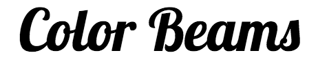
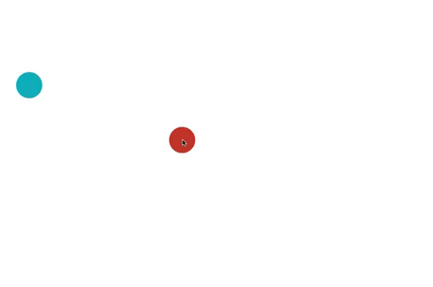
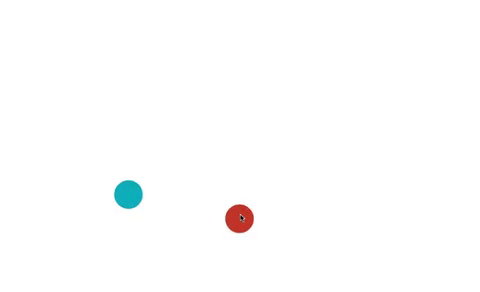
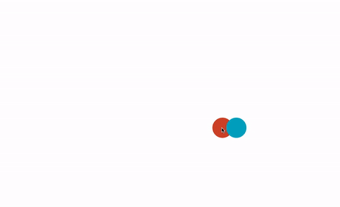
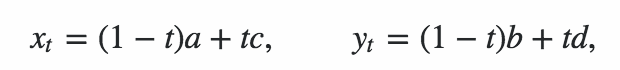
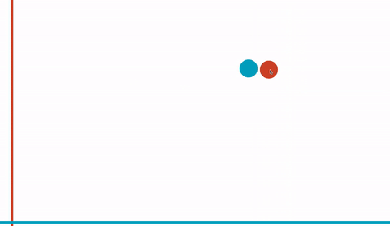

# Color Beams

Color Beams is a minimalist physics-based game. It's pretty fun!




## How It Works
The player maneuvers two circles (one red, one blue) around the screen while red and blue "beams" fly in from different sides of the screen. The goal of the game is to make sure that the red beams only collide with the red circle, and that blue beams only hit the blue circle.

### Circles
The circles are controlled via mouse input. The red circle is tied to the current location of the cursor, while the blue circle is drawn to the cursor's position through some simple physics (more on that below).

### Beams
The beams are generated randomly as the game goes on. The number of beams allowed on the screen is determined by the player's current score, while the velocity of each new beam is slightly greater than the one that came before it.

### Physics
Early on in development, the blue circle simply followed the path the mouse took. This led to some unintuitive controls and strange behavior:


(canvas is not being cleared here to better illustrate the paths taken by the circles.)


Instead, I wanted to implement some basic, elastic physics to make it easy and intuitive to move that blue circle around.

#### Damped Harmonic Oscillation
A good description of harmonic oscillation can be found [here](), but the result is a spring-like effect. The farther away the blue circle is from the red, the greater the force acting on it.



The formula I used to achieve the oscillation:

``` javascript
let m = 500;
let k = 1;
let c = 10;

let offset = this.findRadialOffset(pos, this.pos);

let xAccel =  ( k * (offset[0] - this.pos[0] ) - (c * this.vel[0])) / m;
let yAccel = ( k * (offset[1] - this.pos[1] ) - (c * this.vel[1])) / m;
```

What does that `findRadialOffset` function do? Read on!

#### Setting the Equilibrium Point
If we wanted to, we could simply let the blue circle come to rest on top of the red circle. This would be boring though! Instead, we can dynamically set the equilibrium point to be in between the two circles. This would let us not only slingshot the blue circle around, but push it as well.




To find the new equilibrium point at any moment in time, we can us this formula:



This will give us an x and y coordinate for a position in between two points (the current positions of the two circles). We set the `t` variable based on the distance we want to keep from the current mouse position.

``` javascript
findRadialOffset(pos1, pos2) {
  let d = this.findDistance(pos1, pos2);
  let t = this.radius * 2 / d;
  let x = (1 - t) * pos1[0] + t * pos2[0];
  let y = (1 - t) * pos1[1] + t * pos2[1];
  return [x, y];
}
```


## Plans for the future

- [ ] Diagonal and rotating beams using SAT collision detection.
- [ ] Implement the Web Audio API to randomly generate sound effects for in-game collisions.
- [ ] Color changing and color swapping while the game is being played.
- [ ] Multiple game modes with adjusted dampening settings.



